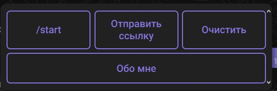
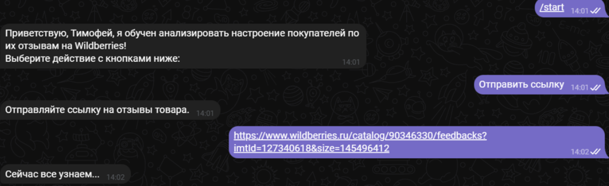
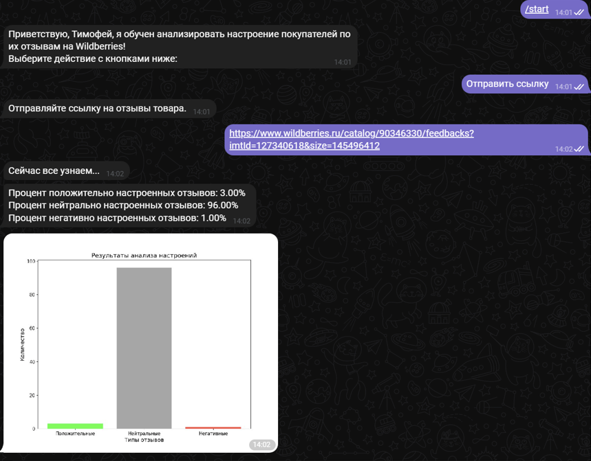
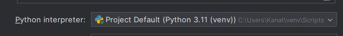
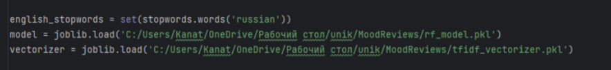

# 😊 MoodReviews
**MoodReviews** - модель по распознаванию настроения покупателей по их отзывам на Wildberries

- **[Telegram бот](https://t.me/Mood_reviews_bot)**

---

## 📸 Превью

- **Меню бота**

  

- **Пример работы**

  

- **Результаты анализа**

  

---

## 🚀 Установка и запуск

1. **Склонируйте репозиторий**:
   
   ```bash
   git clone https://github.com/MelIlya2001/MoodReviews.git
   
2. У вас появятся несколько папок:
   - **`images`** - папка с изображениями для написания README файла;
   - **`__pycache__`** - стандартная папка, созданная Pycharm при создании проекта;

3. Стоит упомянуть версию интерпритатора, на которой этот проект разрабатывался
   

4. В репозитории можно найти файлы расширением .py:
   - **`MODEL.py`** - функции, связанные с обученной моделью: обработка отзывов перед передачей в модель, её использование и возвращение результата;
   - **`REQUESTS.py`** - функции по парсингу отзывов;
   - **`main.py`** - функционал бота и входная точка проекта;
     
   - **`gb_model.pkl`** - обученная модель GradientBoostingClassifier;
   - **`tfidf_vectorizer.pkl`** - модель обученного векторизатора TF-Idf текста отзыва;
   - **`rf_model.rar`** - архив с обученной моделью RandomForestClassifier. Аналог можно скачать на [гугл диске](https://drive.google.com/file/d/1Cvdwnagi4DiYphhrGpAhYwiktB67TfLZ/view?usp=sharing)

5. Укажите ваш путь до обученных моделей
   

6. Скачать chrome driver на свою версию хрома и указать путь до него **`REQUESTS.py`**
   

7. Запустите **`main.py`** - входная точка проекта.
   
8. Можно запускать [бот https://t.me/Mood_reviews_bot](https://t.me/Mood_reviews_bot)
 
---

## 🛠️ Технологии проекта

- **Язык программирования:** Python
- **Библиотеки** Pandas, NumPy, Joblib, NLTK, Re, Scikit-learn, Selenium
- **API:** Telegram API

---

## 📈 Перспективы развития

- Улучшение точности модели и уменьшение времени обработки
- Увеличение набора парсинга, включая другие платформы с отзывами.
- Улучшение Telegram-бота для повышения удобства использования.

---

⭐ **Если вам понравился этот проект, не забудьте поставить звёздочку на GitHub и поделиться им с друзьями!**
